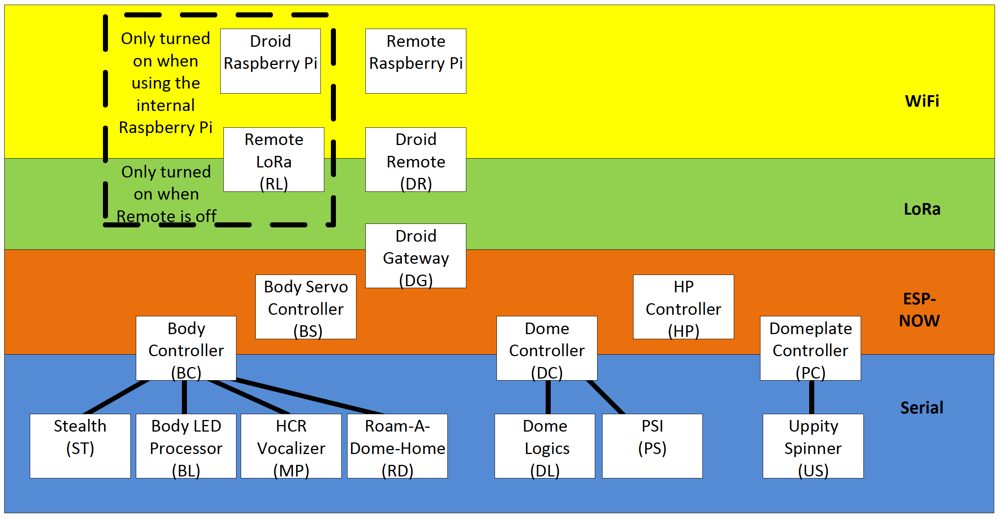

<h1 style="display: inline; font-size:70px;">Code for my R2D2 sketches</h1>
# Board Names with Descriptions
## Custom Boards
1. Body Controller (BC)
    - Runs on an ESP32 WROOM & ATMEGA2560
    -  Sends and Recieves ESP-NOW Messages
    - Sends ESP-NOW Status messages to the Droid Gateway
    - Controls the LED's in the body 
    - Is the central point for all animation
    - Has serial connections to the Roam-A-Dome-Home, Stealth, HCR Vocalizer, and 2 extra serial ports for expansion
2. Body Servo Controller (BS)
    - Runs on an ESP32 WROOM
    -  Sends and Recieves ESP-NOW Messages
    - Sends ESP-NOW Status messages to the Droid Gateway
    - Controls the body's servos
3. Droid Gateway (DG)
    - Runs on a ESP32 Mini Pico
    -  Sends and Recieves ESP-NOW Messages
    - Tracks all status messages 
    - Sends and Receives LoRa messages
    - Sends status to Droid Remote
4. Droid Remote (DR)
    - Runs on a ESP32 Mini Pico
    - Recieves ESP-NOW Messages
    - Sends ESP-NOW Status messages to the Droid Gateway
5. Dome Controller (DC)
    - Runs on an ESP32 WROOM
    -  Sends and Recieves ESP-NOW Messages
    - Sends ESP-NOW Status messages to the Droid Gateway
6. Dome Plate Controller (DP)
    - Runs on an ESP32 WROOM
    -  Sends and Recieves ESP-NOW Messages
    - Sends ESP-NOW Status messages to the Droid Gateway
7. HP Controller (HP)
    - Runs on an ESP32 WROOM
    -  Sends and Recieves ESP-NOW Messages
    - Sends ESP-NOW Status messages to the Droid Gateway
8. Dome Logics Controller (DL)
    - Runs on an ESP32 WROOM
    - Controls the Front and Rear Logics

## Standard Club Boards
1. Stealth System
    - Controls the movement of R2
    - Provides sounds for R2
2. PSI Pro
    - Controls the PSIs

## Communication Overview
There are a few different transmission protocols used in my system.  Below is a picture with the different types of protocols with the boards that run in each protocol

## Command Structure
You can find the current set of commands/structure on a Google Sheets [here](https://docs.google.com/spreadsheets/d/1DH-6CJmIpjQx04wJDilbzKNY-XPePc0232BGUaSPBnk/edit?usp=sharing)

